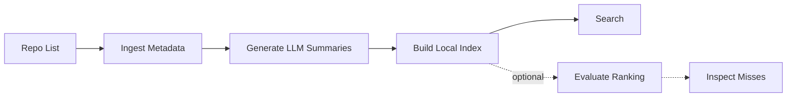

<div align="center"><a name="readme-top"></a>

# xists

Find first. Build later.

`xists` is a local semantic search engine for selected lists of GitHub repositories. Check if a similar project already exists before you build it.

**English** · [简体中文](./README.zh-CN.md)

</div>

---

## Why xists?

Global GitHub search is often noisy, and traditional keyword matching lacks semantic understanding. `xists` solves this by narrowing the search space: you provide a curated repository list, and `xists` builds a local index for semantic search.

- **Before you build**: check if a similar project or existing solution already exists.
- **Tech decisions**: compare candidates from a curated set using semantic search.
- **Fast lookups**: quickly find what you need without manually opening dozens of READMEs.

## How it works



1. **Ingest**: Provide a list of GitHub repos. `xists` fetches their metadata and READMEs.
2. **Profile**: It uses an LLM to generate compact, search-optimized summaries for better matching.
3. **Index**: It builds a local JSON embedding index.
4. **Search**: You query the index using semantic search.

## Local-first index, explicit model endpoints

`xists` keeps everything transparent and local:
- `records.json`: Raw metadata, structure signals, and LLM-generated profiles.
- `index.json`: The embedding index.
- `eval-report.json`: Search quality test results.

You need a GitHub token for the initial data fetch, plus model endpoints for summaries and embeddings. The records, index, ranking, and evaluation report stay on your machine. An embedding endpoint calculates vectors; xists stores them in local JSON and compares them locally.

## Install and first search

Requires Python 3.11+. PyPI publication is prepared for v0.7.0 but has not
yet been authorized; until then, install directly from a checked-out source
tree:

```bash
python -m pip install -e ".[dev]"
```

After v0.7.0 is published, the equivalent package installation will be:

```bash
python -m pip install xists
```

Then create a local configuration file and build an index from repositories
you control:

```bash
cp .env.example .env
# Set the required GitHub, LLM, and embedding variables in .env.

xists ingest github --repos repos.txt --output records.json --report report.json
xists index build --records records.json --output index.json
xists search "open source firebase alternative" --index index.json
```

See [the demo walkthrough](docs/demo.md) for endpoint checks, concurrency,
evaluation, and troubleshooting. No current-schema demo records/index download
is published yet; the first Release asset will be created only after it passes
`records validate` and `index verify`.

---

## Quickstart

Requires Python 3.11+.

```bash
# Install
python -m pip install -e ".[dev]"

# Set up config
cp .env.example .env
# Edit .env with your GitHub token, LLM model, and embedding model
```

**Run the pipeline:**

```bash
# 1. Fetch data & generate summaries
xists ingest github \
  --repos repos.txt \
  --output demo-records.json \
  --report demo-report.json \
  --github-api graphql

# 2. Build the local index
xists index build \
  --records demo-records.json \
  --output demo-index.json

# 3. Search!
xists search "open source firebase alternative" --index demo-index.json
xists search "open source firebase alternative" --index demo-index.json --format json
```

The commands above generate local files and may call the endpoints configured
in `.env`; use `records.json` / `index.json` instead if you do not want files
named as demo artifacts.

---

## Python API

Use the stable API when another Python program needs the same search behavior
as the CLI. Configuration is always explicit; importing `xists.api` does not
read `.env` or send network requests.

```python
from xists.api import load_index, search
from xists.search.embed import EmbeddingConfig

index = load_index("index.json")
config = EmbeddingConfig(
    api_key="your-key",
    base_url="https://your-embedding-endpoint/v1",
    model="your-embedding-model",
)
result = search("open source firebase alternative", index, embedding_config=config, top_k=5)
```

`search()` may call the endpoint in `config` to embed the query. It raises
actionable Python exceptions for invalid indexes, incompatible embedding models,
and endpoint failures instead of printing or terminating the process.

---

## Data, security, and privacy

- `.env` and token files are read only from your local machine; xists does not
  commit, print, telemetry-report, or upload their secret values.
- `ingest github` sends your GitHub token only to GitHub. `profile refresh` and
  ingest-time profile generation send repository text to the configured LLM
  endpoint. `index build` sends embeddable repository text to the configured
  embedding endpoint; `search` and `eval run` send query text to that endpoint.
- A local endpoint keeps those requests on your machine or network. A remote
  endpoint receives the corresponding text under that provider's terms; choose
  it only when you are permitted to send the material. xists does not host the
  endpoint, upload your index, or perform vector search remotely.
- If you share records or indexes, you are responsible for checking repository
  licenses, source content, generated profiles, and any personal or sensitive
  information before distribution.

---

## Search Result Example

When you run a search, `xists` returns a compact text view by default for terminal review. Add `--format json` for scripts and agent integrations. v0.2.0 keeps ranking simple: exact repo/name/alias matches are pinned first, then semantic similarity is adjusted by a few explainable metadata signals.

Default text output looks like this:

```text
query: hermes ai agent
intent: functional
abstained: False
results: 1
1. repo: NousResearch/hermes-agent
   url: https://github.com/NousResearch/hermes-agent
   confidence: high_confidence
   score: 0.680000
   summary: An agent-oriented project for Hermes models.
   why: matched metadata terms: agent
```

The JSON output keeps the same ranking evidence in a machine-readable shape:

```json
{
  "query": "hermes ai agent",
  "results": [
    {
      "repo_id": "NousResearch/hermes-agent",
      "url": "https://github.com/NousResearch/hermes-agent",
      "score": 0.68,
      "semantic_score": 0.63,
      "metadata_score": 0.05,
      "confidence": "high_confidence",
      "why": ["matched metadata terms: agent"]
    }
  ]
}
```

`score` is the final ranking score; higher means a stronger match. Use `--format json` when another program or agent needs the structured payload.

---

## Optional Evaluation

If you update the repository list, regenerate summaries, or change the search setup, `xists` lets you run fixed test cases to sanity-check whether results changed in a meaningful way.

```bash
pytest
xists eval run \
  --cases examples/eval-cases.json \
  --index demo-index.json \
  --output demo-eval-report.json

xists eval inspect --report demo-eval-report.json --status serious_mismatch
```

The report groups results into pragmatic categories:
- **Exact match**: The specific target repo was #1.
- **Acceptable alternative**: Not the exact target, but a valid substitute (e.g., returning Vue when you asked for a React-like framework).
- **Serious mismatch**: The top result missed the core intent.
- **Insufficient evidence**: The indexed data was too thin to judge.

---

## Commands

- `xists doctor`: Check config and file status; add `--check-endpoints` or `--strict` to probe the embedding service.
- `xists ingest github`: Fetch repo metadata and generate summaries.
- `xists index build`: Build or incrementally update the local index.
- `xists search "query"`: Query the local index with readable terminal output by default; add `--format json` for scripts and agents.
- `xists eval cases` / `xists eval run` / `xists eval inspect`: Validate the dataset and run/review ranking tests.
- `xists records validate` / `xists records stats` / `xists records inspect`: Check record quality without printing huge payloads to your terminal.
- `xists index stats` / `xists index verify`: Summarize an index and confirm it is in sync with records.
