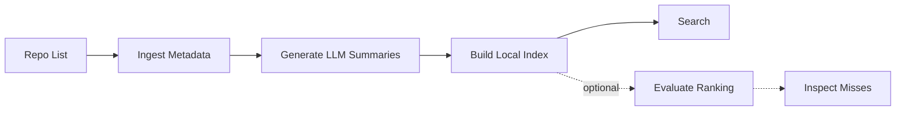

<div align="center"><a name="readme-top"></a>

# xists

Find first. Build later.

`xists` is a local semantic search engine for selected lists of GitHub repositories. Check if a similar project already exists before you build it.

**English** · [简体中文](./README.zh-CN.md)

</div>

---

## Why xists?

Global GitHub search is often noisy, and traditional keyword matching lacks semantic understanding. `xists` solves this by narrowing the search space: you provide a curated repository list, and `xists` builds a local index for semantic search.

- **Before you build**: check if a similar project or existing solution already exists.
- **Tech decisions**: compare candidates from a curated set using semantic search.
- **Fast lookups**: quickly find what you need without manually opening dozens of READMEs.

## How it works



1. **Ingest**: Provide a list of GitHub repos. `xists` fetches their metadata and READMEs.
2. **Profile**: It uses an LLM to generate compact, search-optimized summaries for better matching.
3. **Index**: It builds a local JSON embedding index.
4. **Search**: You query the index using semantic search.

## Local-first by default

`xists` keeps everything transparent and local:
- `records.json`: Raw metadata, structure signals, and LLM-generated profiles.
- `index.json`: The embedding index.
- `eval-report.json`: Search quality test results.

You need a GitHub token for the initial data fetch, plus model endpoints for summaries and search. After repository data is collected, indexing and search can run locally if those model endpoints are local.

---

## Quickstart

Requires Python 3.11+.

```bash
# Install
python -m pip install -e ".[dev]"

# Set up config
cp .env.example .env
# Edit .env with your GitHub token, LLM model, and embedding model
```

**Run the pipeline:**

```bash
# 1. Fetch data & generate summaries
xists ingest github \
  --repos repos.txt \
  --output demo-records.json \
  --report demo-report.json \
  --github-api graphql

# 2. Build the local index
xists index build \
  --records demo-records.json \
  --output demo-index.json

# 3. Search!
xists search "open source firebase alternative" --index demo-index.json
```

---

## Search Result Example

When you run a search, `xists` returns ranked repositories as JSON. A simplified result looks like this:

```json
{
  "query": "hermes ai agent",
  "results": [
    {
      "repo_id": "NousResearch/hermes-agent",
      "score": 0.68
    }
  ]
}
```

`score` is the final ranking score; higher means a stronger match.

---

## Optional Evaluation

If you update the repository list, regenerate summaries, or change the search setup, `xists` lets you run fixed test cases to sanity-check whether results changed in a meaningful way.

```bash
pytest
xists eval run \
  --cases examples/eval-cases.json \
  --index demo-index.json \
  --output demo-eval-report.json

xists eval inspect --report demo-eval-report.json --status serious_mismatch
```

The report groups results into pragmatic categories:
- **Exact match**: The specific target repo was #1.
- **Acceptable alternative**: Not the exact target, but a valid substitute (e.g., returning Vue when you asked for a React-like framework).
- **Serious mismatch**: The top result missed the core intent.
- **Insufficient evidence**: The indexed data was too thin to judge.

---

## Commands

- `xists doctor`: Check config and verify file status.
- `xists ingest github`: Fetch repo metadata and generate summaries.
- `xists index build`: Build or incrementally update the local index.
- `xists search "query"`: Query the local index.
- `xists eval run` / `xists eval inspect`: Run and review ranking tests.
- `xists records inspect` / `xists index stats`: Quickly view data without printing huge payloads to your terminal.
