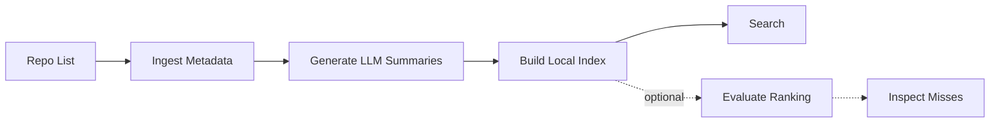

<div align="center"><a name="readme-top"></a>


# xists

Find what exists. Decide what's next.

`xists` is a local semantic search engine for selected lists of GitHub repositories. Find existing projects you can use, deploy, adapt, or learn from—then decide what to do next.

**English** · [简体中文](./README.zh-CN.md)

</div>

---

## Why xists?

Global GitHub search is often noisy, and traditional keyword matching lacks semantic understanding. `xists` solves this by narrowing the search space: you provide a curated repository list, and `xists` builds a local index for semantic search.

- **Before you decide**: check if a similar project or existing solution already exists.
- **Tech decisions**: compare candidates from a curated set using semantic search.
- **Fast lookups**: quickly find what you need without manually opening dozens of READMEs.

## How it works


```mermaid
flowchart LR
    A[Repo List] --> B[Ingest Metadata]
    B --> C[Generate LLM Summaries]
    C --> D[Build Local Index]
    D --> E[Search]
    D -. optional .-> F[Evaluate Ranking]
    F -.-> G[Inspect Misses]
```

1. **Ingest**: Provide a list of GitHub repos. `xists` fetches their metadata and READMEs.
2. **Profile**: It uses an LLM to generate compact, search-optimized summaries for better matching.
3. **Index**: It builds a local JSON embedding index.
4. **Search**: You query the index using semantic search.

## Local-first index, explicit model endpoints

`xists` keeps everything transparent and local:
- `records.json`: Raw metadata, structure signals, and LLM-generated profiles.
- `index.json`: The embedding index.
- `eval-report.json`: Search quality test results.

You need a GitHub token for the initial data fetch, plus model endpoints for summaries and embeddings. The records, index, ranking, and evaluation report stay on your machine. An embedding endpoint calculates vectors; xists stores them in local JSON and compares them locally.

## Install and first search

Requires Python 3.11+. Install the published package:

```bash
python -m pip install xists
```

For development from a checked-out source tree, install the editable package
with test dependencies:

```bash
python -m pip install -e ".[dev]"
```

### Quickstart (Zero-Config Demo)

Get started instantly without API keys or token configuration:

```bash
# 1. Initialize workspace with bundled starter demo repositories and binary index
xists init --demo

# 2. Try instant semantic/offline search
xists search "open source firebase alternative"
xists search --demo "fast python linter"

# 3. Pull or update curated indexes anytime
xists index pull demo
```

### Index Your Own Repositories

```bash
# 1. Initialize workspace
xists init

# 2. Configure ~/.xists/.env and add owner/repo lines to ~/.xists/repos.txt
xists doctor

# 3. Ingest, build index, and search
xists ingest github
xists index build
xists search "open source firebase alternative"
```

---

## MCP and agent integration

Install the optional MCP integration after a workspace has an index and an
embedding configuration:

```bash
python -m pip install "xists[mcp]"
xists mcp
```

`xists mcp` uses stdio and reads the same active workspace as the CLI. It
loads the index when the server starts; rebuild the index and restart the MCP
server when data changes. It exposes `search_projects`, `find_similar_projects`,
`compare_projects`, `inspect_project`, and `index_stats`. Search results include
the same ranking and abstention behavior as the CLI, so diagnose an agent request with:

```bash
xists search "browser automation for agents" --format json
```

For Claude Code, Cursor, or Cline, add a stdio server entry using this shape in
that client's MCP configuration:

```json
{
  "mcpServers": {
    "xists": {
      "command": "xists",
      "args": ["mcp"]
    }
  }
}
```

The server follows the normal configuration precedence: shell environment,
current-directory `.env`, then `~/.xists/.env`. A remote embedding endpoint
receives each search query to calculate its vector; the index and similarity
search remain local. An `abstained: true` response means the current index did
not contain a sufficiently credible match and should be treated as that state,
not as a hidden failure.

### Optional Codex skill

The repository also includes the `xists-project-search` Skill. It tells Codex
when to use a configured xists MCP server, limits unnecessary tool calls, and
preserves honest no-result behavior. Install it from GitHub with the bundled
Codex installer:

```bash
python "${CODEX_HOME:-$HOME/.codex}/skills/.system/skill-installer/scripts/install-skill-from-github.py" \
  --repo UsonTong/xists --path skills/xists-project-search
```

After starting a new Codex turn, requests to find or compare existing
open-source projects can use the Skill and your configured xists MCP server.
The Skill contains no index, endpoint, or credential configuration; configure
the MCP server separately.

---

## Quickstart

Requires Python 3.11+.

```bash
# Install
python -m pip install -e ".[dev]"

# Set up the default workspace configuration
xists init
# Edit ~/.xists/.env with your GitHub token, LLM model, and embedding model
```

**Run the pipeline:**

```bash
# 1. Fetch data & generate summaries
xists ingest github \
  --repos repos.txt \
  --output demo-records.json \
  --report demo-report.json \
  --github-api graphql

# 2. Build the local index
xists index build \
  --records demo-records.json \
  --output demo-index.json

# 3. Search!
xists search "open source firebase alternative" --index demo-index.json
xists search "open source firebase alternative" --index demo-index.json --format json
```

The commands above generate local files and may call the endpoints configured
in `.env`; use `records.json` / `index.json` instead if you do not want files
named as demo artifacts.

### Find Similar Projects & Side-by-Side Comparison

`xists` provides zero-remote-call relational exploration and multi-project horizontal comparison:

```bash
# Find similar alternatives to a repository (offline vector retrieval)
xists similar supabase/supabase --top-k 5
xists similar astral-sh/ruff --language python --min-stars 1000

# Compare 2 to 5 repositories side-by-side with similarity matrix and differentiators
xists compare langchain-ai/langchain run-llama/llama_index crewAIInc/crewAI
xists compare qdrant/qdrant chroma-core/chroma milvus-io/milvus --format json
```

---

## Python API

Use the stable API when another Python program needs the same search, similarity, or comparison behavior
as the CLI. Configuration is always explicit; importing `xists.api` does not
read `.env` or send network requests.

```python
from xists.api import compare_projects, find_similar, load_index, search
from xists.search.embed import EmbeddingConfig

index = load_index("index.json")
config = EmbeddingConfig(
    api_key="your-key",
    base_url="https://your-embedding-endpoint/v1",
    model="your-embedding-model",
)

# 1. Semantic search with query embedding
result = search("open source firebase alternative", index, embedding_config=config, top_k=5)

# 2. Find similar alternatives (instant, 0 remote API calls, uses stored unit vectors)
similar = find_similar("supabase/supabase", index, top_k=5)

# 3. Horizontal side-by-side comparison & pairwise cosine similarity matrix
comparison = compare_projects(["astral-sh/ruff", "psf/black", "PyCQA/isort"], index)
```

`search()` may call the endpoint in `config` to embed the query. It raises
actionable Python exceptions for invalid indexes, incompatible embedding models,
and endpoint failures instead of printing or terminating the process.

---

## Data, security, and privacy

- `.env` and token files are read only from your local machine; xists does not
  commit, print, telemetry-report, or upload their secret values.
- `ingest github` sends your GitHub token only to GitHub. `profile refresh` and
  ingest-time profile generation send repository text to the configured LLM
  endpoint. `index build` sends embeddable repository text to the configured
  embedding endpoint; `search` and `eval run` send query text to that endpoint.
- A local endpoint keeps those requests on your machine or network. A remote
  endpoint receives the corresponding text under that provider's terms; choose
  it only when you are permitted to send the material. xists does not host the
  endpoint, upload your index, or perform vector search remotely.
- If you share records or indexes, you are responsible for checking repository
  licenses, source content, generated profiles, and any personal or sensitive
  information before distribution.

---

## Search Result Example

When you run a search, `xists` returns a compact text view by default for terminal review. Add `--format json` for scripts and agent integrations. Search combines embedding similarity with bounded, explainable metadata signals. Exact `owner/repo` and exact name/alias lookups are pinned first; project names mentioned inside a broader natural-language request remain contextual evidence rather than an exact lookup.

Default text output looks like this:

```text
query: hermes ai agent
intent: functional
abstained: False
results: 1
1. repo: NousResearch/hermes-agent
   url: https://github.com/NousResearch/hermes-agent
   confidence: high_confidence
   score: 0.680000
   summary: An agent-oriented project for Hermes models.
   why: matched metadata terms: agent
```

The JSON output keeps the same ranking evidence in a machine-readable shape:

```json
{
  "query": "hermes ai agent",
  "results": [
    {
      "repo_id": "NousResearch/hermes-agent",
      "url": "https://github.com/NousResearch/hermes-agent",
      "score": 0.68,
      "semantic_score": 0.63,
      "metadata_score": 0.05,
      "confidence": "high_confidence",
      "why": ["matched metadata terms: agent"]
    }
  ]
}
```

`score` is the final ranking score; higher means a stronger match. Use `--format json` when another program or agent needs the structured payload.

Chinese and mixed-language requests are first-class query inputs. xists keeps
ASCII technical identifiers such as `Node.js`, `C++`, `C#`, `.NET`, and
`owner/repo`, while extracting a bounded set of CJK bigrams/trigrams for query
intent, metadata overlap, and explanations. Run the committed offline contract fixture with
`python scripts/run_retrieval_regression.py`.

---

## Optional Evaluation

If you update the repository list, regenerate summaries, or change the search setup, `xists` lets you run fixed test cases to sanity-check whether results changed in a meaningful way.

```bash
pytest
xists eval run \
  --cases examples/eval-cases.json \
  --index demo-index.json \
  --output demo-eval-report.json

xists eval inspect --report demo-eval-report.json --status serious_mismatch
```

The report groups results into pragmatic categories:
- **Exact match**: The specific target repo was #1.
- **Acceptable alternative**: Not the exact target, but a valid substitute (e.g., returning Vue when you asked for a React-like framework).
- **Serious mismatch**: The top result missed the core intent.
- **Insufficient evidence**: The indexed data was too thin to judge.

---

## Commands

- `xists doctor`: Check config and file status; add `--check-endpoints` or `--strict` to probe the embedding service.
- `xists ingest github`: Fetch repo metadata and generate summaries.
- `xists index build`: Build or incrementally update the local index.
- `xists index append`: Incrementally append single repos or batch records directly to index and binary vectors.
- `xists index merge`: Merge multiple index documents and binary vector matrices with automatic conflict resolution.
- `xists index prune`: Purge archived, disabled, or blocklisted repositories and slice vector matrices.
- `xists index pull`: Download and install pre-built indexes and datasets (e.g. `xists index pull demo`).
- `xists search "query"`: Query the local index with readable terminal output by default; add `--format json` for scripts and agents.
- `xists eval cases` / `xists eval run` / `xists eval inspect`: Validate the dataset and run/review ranking tests.
- `xists records validate` / `xists records stats` / `xists records inspect`: Check record quality without printing huge payloads to your terminal.
- `xists index stats` / `xists index verify`: Summarize an index and confirm it is in sync with records.
