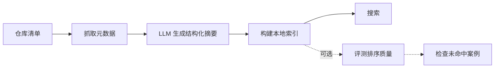

<div align="center"><a name="readme-top"></a>

# xists

先找，再做。

`xists` 是一个面向 GitHub 仓库清单的本地语义搜索工具。造轮子前，先用它查查是否有类似项目或现成方案。

[English](./README.md) · **简体中文**

</div>

---

## 为什么写 xists？

GitHub 的全局搜索常常伴随较高的信息噪音，而传统的关键词匹配又受限于字面约束。`xists` 的核心思路是通过缩小搜索域来提升精度：基于用户提供的特定仓库清单构建本地索引，从而实现更高效的语义检索。

- **动手之前**：通过语义检索查一下有没有类似项目或现成方案。
- **技术选型**：在候选项目池里快速比对，不用挨个翻 README。
- **快速定位**：告别精确关键词，用你脑海里的描述直接搜。

## 工作流



1. **拉取**：提供仓库列表，`xists` 通过 GitHub API 抓取它们的元数据和 README。
2. **总结**：调用 LLM 为每个仓库生成适合被检索的结构化短语和简介。
3. **索引**：在本地构建基于 Embedding 的 JSON 向量索引。
4. **搜索**：直接在本地进行语义检索。

## 本地优先

`xists` 所有的中间产物和结果都透明且受你掌控：
- `records.json`：存放仓库的基础信息和 LLM 生成的特征画像。
- `index.json`：本地的 Embedding 索引。
- `eval-report.json`：检索质量评测报告。

首次采集需要 GitHub token 和 GitHub API；生成摘要与搜索还需要模型接口。仓库数据采集完成后，如果模型接口也部署在本地，后续索引和搜索可以在本地完成。

---

## 快速开始

环境要求：Python 3.11+。

```bash
# 安装
python -m pip install -e ".[dev]"

# 配置
cp .env.example .env
# 在 .env 中填入你的 GitHub token、LLM 模型和 embedding 模型配置
```

**跑通全流程：**

```bash
# 1. 抓取数据并生成总结
xists ingest github \
  --repos repos.txt \
  --output demo-records.json \
  --report demo-report.json \
  --github-api graphql

# 2. 构建本地向量索引
xists index build \
  --records demo-records.json \
  --output demo-index.json

# 3. 开始搜索！
xists search "open source firebase alternative" --index demo-index.json
xists search "open source firebase alternative" --index demo-index.json --format json
```

---

## 检索结果示例

每次搜索，`xists` 默认都会输出适合终端阅读的紧凑文本。脚本和 agent 集成可以加 `--format json` 获取结构化结果。v0.2.0 的排序刻意保持简单：先固定精确 repo/name/alias 命中，再用少量可解释 metadata 信号调整语义相似度。

默认文本输出类似这样：

```text
query: hermes ai agent
intent: functional
abstained: False
results: 1
1. repo: NousResearch/hermes-agent
   url: https://github.com/NousResearch/hermes-agent
   confidence: high_confidence
   score: 0.680000
   summary: An agent-oriented project for Hermes models.
   why: matched metadata terms: agent
```

JSON 输出保留相同的排序证据，适合机器读取：

```json
{
  "query": "hermes ai agent",
  "results": [
    {
      "repo_id": "NousResearch/hermes-agent",
      "url": "https://github.com/NousResearch/hermes-agent",
      "score": 0.68,
      "semantic_score": 0.63,
      "metadata_score": 0.05,
      "confidence": "high_confidence",
      "why": ["matched metadata terms: agent"]
    }
  ]
}
```

`score` 是最终排序分数，越高代表匹配越强。其他程序或 agent 需要结构化 payload 时使用 `--format json`。

---

## 可选评测

如果你更换了仓库清单、重新生成了摘要，或调整了搜索配置，`xists` 内置的评测工具可以用固定测试用例帮你检查结果是否有明显变化：

```bash
pytest
xists eval run \
  --cases examples/eval-cases.json \
  --index demo-index.json \
  --output demo-eval-report.json

# 直接查看错误的 Case
xists eval inspect --report demo-eval-report.json --status serious_mismatch
```

评测报告会将结果分为以下几种务实的类型：
- **精确命中**：第一名就是预期中的目标仓库。
- **可接受替代**：第一名不是指定仓库，但也是个合理的同类竞品（比如你搜 React 相关的，它推了 Vue）。
- **明显不匹配**：第一名完全不符合搜索意图。
- **证据不足**：索引的数据太少，没法客观判断。

---

## 常用命令一览

- `xists doctor`：检查本地配置和文件状态；加 `--check-endpoints` 或 `--strict` 可探测 embedding 服务。
- `xists ingest github`：拉取仓库信息并生成短语摘要。
- `xists index build`：构建或增量更新本地向量索引。
- `xists search "query"`：执行搜索，默认输出适合终端阅读；加 `--format json` 可输出给脚本和 agent 使用的结构化结果。
- `xists eval cases` / `xists eval run` / `xists eval inspect`：校验评测集并运行、检查检索评测。
- `xists records inspect` / `xists index stats`：快速查看数据状态，避免终端被长 JSON 刷屏。
