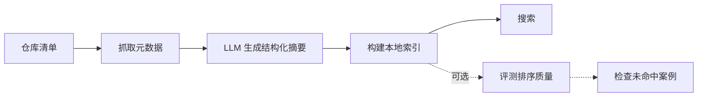

<div align="center"><a name="readme-top"></a>


# xists

先找已有的，再决定下一步。

`xists` 是一个面向 GitHub 仓库清单的本地语义搜索工具。找到可直接使用、部署、改造或学习的已有项目，再决定下一步怎么做。

[English](./README.md) · **简体中文**

</div>

---

## 为什么写 xists？

GitHub 的全局搜索常常伴随较高的信息噪音，而传统的关键词匹配又受限于字面约束。`xists` 的核心思路是通过缩小搜索域来提升精度：基于用户提供的特定仓库清单构建本地索引，从而实现更高效的语义检索。

- **决定之前**：通过语义检索查一下有没有类似项目或现成方案。
- **技术选型**：在候选项目池里快速比对，不用挨个翻 README。
- **快速定位**：告别精确关键词，用你脑海里的描述直接搜。

## 工作流


```mermaid
flowchart LR
    A[仓库清单] --> B[抓取元数据]
    B --> C[LLM 生成结构化摘要]
    C --> D[构建本地索引]
    D --> E[搜索]
    D -. 可选 .-> F[评测排序质量]
    F -.-> G[检查未命中案例]
```

1. **拉取**：提供仓库列表，`xists` 通过 GitHub API 抓取它们的元数据和 README。
2. **总结**：调用 LLM 为每个仓库生成适合被检索的结构化短语和简介。
3. **索引**：在本地构建基于 Embedding 的 JSON 向量索引。
4. **搜索**：直接在本地进行语义检索。

## 本地索引，模型接口显式配置

`xists` 所有的中间产物和结果都透明且受你掌控：
- `records.json`：存放仓库的基础信息和 LLM 生成的特征画像。
- `index.json`：本地的 Embedding 索引。
- `eval-report.json`：检索质量评测报告。

首次采集需要 GitHub token；生成摘要与 embedding 还需要模型接口。records、index、排序和评测报告都保留在本机。embedding 接口只负责计算向量；xists 把向量保存为本地 JSON，并在本地完成相似度计算与排序。

## 安装与第一次搜索

环境要求：Python 3.11+。安装已发布的包：

```bash
python -m pip install xists
```

若从检出的源码目录开发，请以 editable 方式安装并附带测试依赖：

```bash
python -m pip install -e ".[dev]"
```

### 零配置快速体验 (Zero-Config Demo)

无需配置任何 API Key 或 GitHub Token，即可立刻体验：

```bash
# 1. 初始化工作区并载入内置 Starter 演示数据集与二进制索引
xists init --demo

# 2. 体验即时语义/离线搜索
xists search "open source firebase alternative"
xists search --demo "fast python linter"

# 3. 随时拉取或更新精选索引
xists index pull demo
```

### 索引自己的仓库列表

```bash
# 1. 初始化工作区
xists init

# 2. 编辑 ~/.xists/.env 并添加仓库列表至 ~/.xists/repos.txt
xists doctor

# 3. 抓取、建库并搜索
xists ingest github
xists index build
xists search "open source firebase alternative"
```

---

## MCP 与 agent 集成

当 workspace 已有 index 且已配置 embedding 后，安装可选 MCP 集成：

```bash
python -m pip install "xists[mcp]"
xists mcp
```

`xists mcp` 使用 stdio，并读取与 CLI 相同的当前 workspace。server 启动时加载
index；数据更新或重建 index 后，需要重启 MCP server。它提供
`search_projects`、`inspect_project` 和 `index_stats` 三个工具。搜索排序和
未命中语义与 CLI 相同，排查 agent 请求时可运行：

```bash
xists search "browser automation for agents" --format json
```

Claude Code、Cursor、Cline 的 MCP 配置均可使用以下 stdio server 结构：

```json
{
  "mcpServers": {
    "xists": {
      "command": "xists",
      "args": ["mcp"]
    }
  }
}
```

server 的配置优先级与普通 CLI 一致：shell 环境变量、当前目录 `.env`、
`~/.xists/.env`。若使用远端 embedding 接口，每次搜索的查询文本会发送至该
接口以计算向量；index 与相似度检索仍在本地进行。`abstained: true` 表示当前
index 中没有足够可信的匹配，agent 应如实处理该状态，而不是将其视为隐藏错误。

### 可选 Codex Skill

仓库还包含 `xists-project-search` Skill。它规定 Codex 在何时使用已配置的
xists MCP server、限制不必要的 tool 调用，并保留诚实的无结果语义。可通过 Codex
自带 installer 从 GitHub 安装：

```bash
python "${CODEX_HOME:-$HOME/.codex}/skills/.system/skill-installer/scripts/install-skill-from-github.py" \
  --repo UsonTong/xists --path skills/xists-project-search
```

新开一个 Codex turn 后，寻找或比较已有开源项目的请求即可使用该 Skill 与已配置的
xists MCP server。Skill 不包含 index、endpoint 或凭据配置；这些仍需单独配置
MCP server。

---

## 快速开始

环境要求：Python 3.11+。

```bash
# 安装
python -m pip install -e ".[dev]"

# 配置默认工作目录
xists init
# 在 ~/.xists/.env 中填入 GitHub token、LLM 模型和 embedding 模型配置
```

**跑通全流程：**

```bash
# 1. 抓取数据并生成总结
xists ingest github \
  --repos repos.txt \
  --output demo-records.json \
  --report demo-report.json \
  --github-api graphql

# 2. 构建本地向量索引
xists index build \
  --records demo-records.json \
  --output demo-index.json

# 3. 开始搜索！
xists search "open source firebase alternative" --index demo-index.json
xists search "open source firebase alternative" --index demo-index.json --format json
```

上面的命令会生成本地文件，并可能调用 `.env` 里配置的接口；若不希望使用 demo 命名，请改用 `records.json` 和 `index.json`。

---

## Python API

其他 Python 程序需要使用和 CLI 相同的搜索逻辑时，可以使用稳定 API。配置必须显式传入；导入 `xists.api` 不会读取 `.env`，也不会发起网络请求。

```python
from xists.api import load_index, search
from xists.search.embed import EmbeddingConfig

index = load_index("index.json")
config = EmbeddingConfig(
    api_key="your-key",
    base_url="https://your-embedding-endpoint/v1",
    model="your-embedding-model",
)
result = search("open source firebase alternative", index, embedding_config=config, top_k=5)
```

`search()` 会按需调用 `config` 指定的接口来计算查询向量。无效 index、embedding 模型不兼容或接口失败会以可捕获的 Python 异常返回，不会打印信息或结束进程。

---

## 数据、安全与隐私

- `.env` 和 token 文件只在本地读取；xists 不会提交、打印、遥测上报或上传其中的密钥。
- `ingest github` 只会把 GitHub token 发给 GitHub。`profile refresh` 与 ingest 中生成 profile 的步骤会把仓库文本发送给你配置的 LLM 接口。`index build` 会把可 embedding 的仓库文本发送给 embedding 接口；`search` 和 `eval run` 会把查询文本发送给该接口。
- 选择本地接口时，请求会留在你的机器或网络中；选择远端接口时，对应文本会发送给该提供商，并受其条款约束。xists 不托管接口、不上传你的 index，也不在远端执行向量搜索。
- 若你分享 records 或 index，需要自行检查仓库许可证、源内容、生成的 profile，以及其中是否包含个人或敏感信息。

---

## 检索结果示例

每次搜索，`xists` 默认都会输出适合终端阅读的紧凑文本。脚本和 agent 集成可以加 `--format json` 获取结构化结果。搜索会结合 embedding 相似度与有界、可解释的 metadata 信号。精确的 `owner/repo` 和精确 name/alias 查询会被置顶；在较长自然语言请求中出现的项目名仅作为上下文证据，不会被当作精确查询。

默认文本输出类似这样：

```text
query: hermes ai agent
intent: functional
abstained: False
results: 1
1. repo: NousResearch/hermes-agent
   url: https://github.com/NousResearch/hermes-agent
   confidence: high_confidence
   score: 0.680000
   summary: An agent-oriented project for Hermes models.
   why: matched metadata terms: agent
```

JSON 输出保留相同的排序证据，适合机器读取：

```json
{
  "query": "hermes ai agent",
  "results": [
    {
      "repo_id": "NousResearch/hermes-agent",
      "url": "https://github.com/NousResearch/hermes-agent",
      "score": 0.68,
      "semantic_score": 0.63,
      "metadata_score": 0.05,
      "confidence": "high_confidence",
      "why": ["matched metadata terms: agent"]
    }
  ]
}
```

`score` 是最终排序分数，越高代表匹配越强。其他程序或 agent 需要结构化 payload 时使用 `--format json`。

中文和中英混合请求是一等查询输入。xists 会保留 `Node.js`、`C++`、
`C#`、`.NET`、`owner/repo` 等 ASCII 技术标识，并提取数量有界的 CJK
二元/三元片段，用于 query intent、metadata overlap 与解释输出。参见
[当前检索基线](docs/current-retrieval-baseline.md)，也可以运行
`python scripts/run_retrieval_regression.py` 验证已提交的离线契约 fixture。

---

## 可选评测

如果你更换了仓库清单、重新生成了摘要，或调整了搜索配置，`xists` 内置的评测工具可以用固定测试用例帮你检查结果是否有明显变化：

```bash
pytest
xists eval run \
  --cases examples/eval-cases.json \
  --index demo-index.json \
  --output demo-eval-report.json

# 直接查看错误的 Case
xists eval inspect --report demo-eval-report.json --status serious_mismatch
```

评测报告会将结果分为以下几种务实的类型：
- **精确命中**：第一名就是预期中的目标仓库。
- **可接受替代**：第一名不是指定仓库，但也是个合理的同类竞品（比如你搜 React 相关的，它推了 Vue）。
- **明显不匹配**：第一名完全不符合搜索意图。
- **证据不足**：索引的数据太少，没法客观判断。

---

## 常用命令一览

- `xists doctor`：检查本地配置和文件状态；加 `--check-endpoints` 或 `--strict` 可探测 embedding 服务。
- `xists ingest github`：拉取仓库信息并生成短语摘要。
- `xists index build`：构建或增量更新本地向量索引。
- `xists search "query"`：执行搜索，默认输出适合终端阅读；加 `--format json` 可输出给脚本和 agent 使用的结构化结果。
- `xists eval cases` / `xists eval run` / `xists eval inspect`：校验评测集并运行、检查检索评测。
- `xists records validate` / `xists records stats` / `xists records inspect`：检查 records 质量，避免终端被长 JSON 刷屏。
- `xists index stats` / `xists index verify`：概览 index，并确认它和 records 仍然同步。
